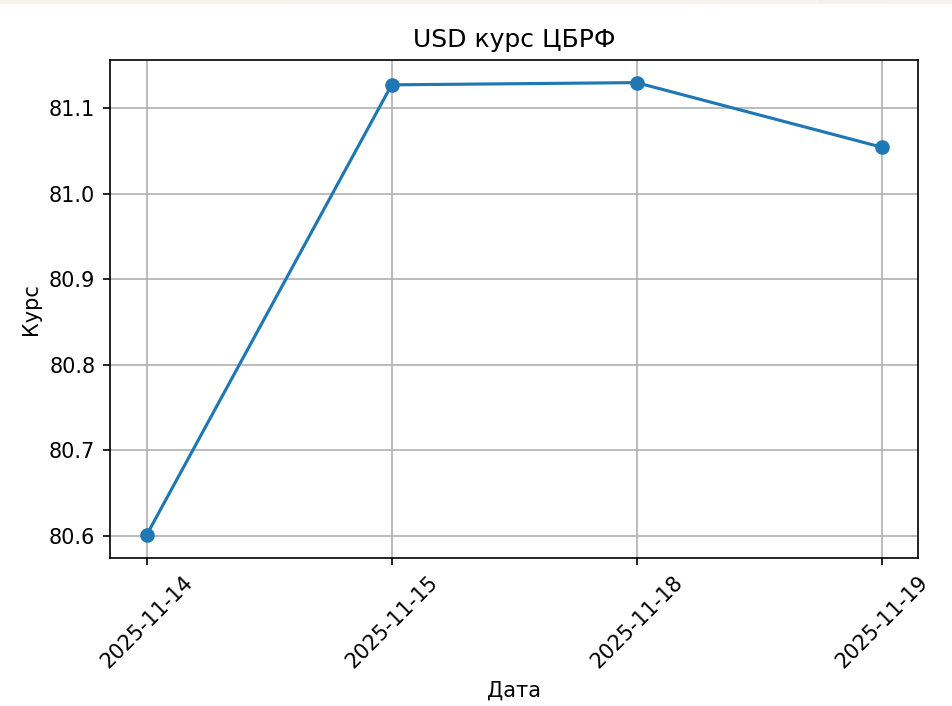
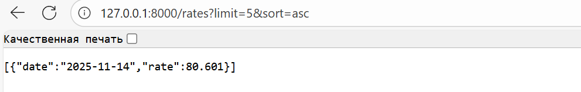

## USD track Py
Проект для сбора, хранения, анализа и предоставления курса USD с сайта ЦБ РФ на Python.
### Что делает проект
1. Сбор данных (скрапинг)  
   - `scraper.py` получает текущий курс USD с сайта ЦБ РФ.  
   - Сохраняет данные в JSON-файл в папке `data/` (например: `data/2025-09-22.json`).  

2. Анализ и визуализация
   -  plot.py строит график динамики курса USD с помощью matplotlib.
   -  График отображается в отдельном окне matplotlib.
   
   
     
3. API для получения исторических курсов USD из JSON-файлов (data/).
   - Параметры: limit (1–100, по умолчанию 10), sort (asc/desc, по умолчанию desc)

### Установка зависимостей
    pip install -r requirements.txt

### Сбор первого курса USD
    python scraper.py

### Построение графика
    python plot.py

### Rates API
API на FastAPI для получения исторических курсов USD из JSON-файлов (`data/`). 
Запуск:  
     
    uvicorn app.main:app --reload
Эндпоинт: `GET /rates`  
Параметры: `limit` (1–100, по умолчанию 10), `sort` (`asc`/`desc`, по умолчанию `desc`)  
Пример: 'http://127.0.0.1:8000/rates', 'GET http://127.0.0.1:8000/rates?limit=5&sort=desc'

Swagger UI: 'http://127.0.0.1:8000/docs'

Этот проект распространяется под лицензией MIT.
Подробности см. в файле [LICENSE](./LICENSE).
